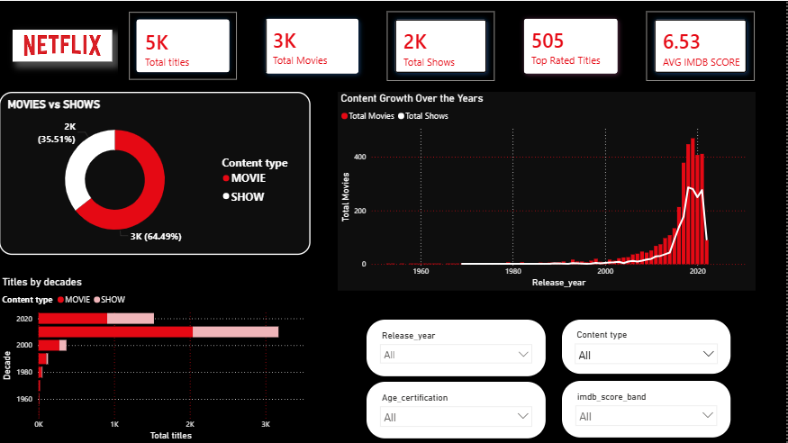

# 🎬 Netflix Content Strategy & Data Analysis Report

## 📌 Project Overview
This project delivers a comprehensive, end-to-end data analysis of Netflix's movie and TV show library. Using **Power BI and Power Query**, I transformed raw, unstructured data into a highly interactive report that provides actionable insights into content trends, ratings, and global distribution.

---

## 📊 Key Insights Captured
- **Content Type Distribution:** Analyzed the ratio of Movies vs. TV Shows dominating the platform.
- **Audience Targeting:** Identified that the majority of content targets mature audiences (TV-MA), driving strategic acquisition signals.
- **Release Trends:** Leveraged time-series intelligence to track content release growth over recent decades.

---

## 🛠️ Technical Skills & Tools Used
- **Data Cleaning (Power Query):** Standardized text categorical attributes, handled strict null values, and optimized data types.
- **Data Modeling:** Established a robust star-schema relationship by connecting a custom-made **Date Table** to the core orders for advanced time intelligence.
- **DAX Metrics:** Developed explicit measures using advanced expressions for accurate operational KPIs.

---

## 📸 Dashboard Preview
*Here is a preview of the interactive Power BI report:*

